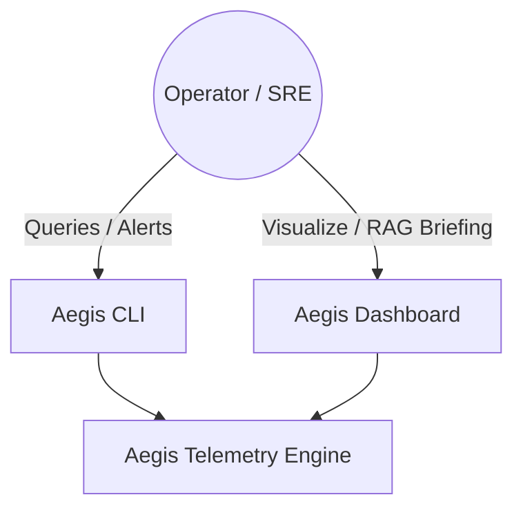
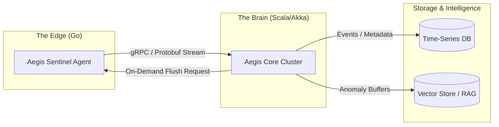

# Aegis: Distributed Telemetry Engine 🛡️
### Solving the "Context Gap" in Distributed Observability

Aegis is a high-fidelity telemetry engine that moves beyond passive monitoring. It captures the "Why" behind system anomalies by maintaining a rolling 60-second window of deep system state at the edge, flushing it to a Scala-powered brain for real-time correlation and diagnostic briefings.

---

## 🧠 The Core Philosophy

### The Edge (Go) — *The Intelligent Sentinel*
Instead of a passive collector, the Aegis Go agent acts as a sentinel. It uses a **Ring-Buffer Strategy** to store the last 60 seconds of high-fidelity state (syscalls, network packets, stack traces) locally. Data is only flushed when a threshold is hit or when explicitly requested by the Brain.

### The Brain (Scala) — *The Global State Map*
Using the **actor pattern** (one state object per sentinel — plain Scala concurrency, no Akka dependency), the cluster treats incoming telemetry as a continuous stream of events. It runs sliding-window analysis to correlate events across different agents (e.g., matching a latency spike on Agent A with a connection drop on Agent B).

### The Insight (RAG Layer) — *Diagnostic Briefings*
When an anomaly is detected (by the agent's threshold triggers or the brain's z-score detector), Aegis retrieves the 60-second buffer, indexes it into a vector store, and produces a **Diagnostic Briefing**. The default generator is deterministic (template-based) behind a pluggable `Llm` interface — see [ADR-008](docs/adr/ADR-008-rag-briefing-deterministic-defaults.md).

---

## 🛠 Project Structure

- **`agent/`**: Go-based intelligent sentinels.
  - `cmd/agent/` — Agent entrypoint with signal handling and graceful shutdown.
  - `internal/scraper/` — CPU, memory, FD, TCP/TCP6 connection, and syscall scraping from `/proc`.
  - `internal/buffer/` — Thread-safe ring buffer with 60s time-window and byte-budget eviction.
  - `internal/anomaly/` — Local threshold triggers (CPU/memory, consecutive-breach streak, cooldown) emitting `AnomalyEvent`s — see [ADR-009](docs/adr/ADR-009-agent-local-analytics-edge-detection.md).
  - `internal/transport/` — gRPC bidirectional stream client: reconnect with exponential backoff, spool replay on (re)connect, backpressure handling (`SLOW_DOWN`, `RESUME`, `FLUSH_NOW`, `DROP_LOW_PRIORITY`).
  - `internal/persistence/` — Flat-file spool (protojson) for zero-drop caching during brain outages, replayed on reconnect.
  - `internal/config/` — Environment-driven agent configuration (scrape interval, buffer size, anomaly thresholds).
  - `pkg/telemetry/pb/` — Generated Protobuf/GRPC Go bindings.
- **`cluster/`**: Scala/Akka-based correlation brain.
  - `TelemetryServiceImpl` — gRPC server: bi-directional stream ingestion + chunked flush (~1MB chunks).
  - `SentinelState` — Per-agent 60s sliding buffer + 5s rate tracker (actor-per-sentinel pattern).
  - `StartupReindexer` — Rebuilds the in-memory retrieval index from persisted windows at startup (and on `POST /api/v1/index`).
  - `AnomalyDetector` — Rolling z-score detection (WARNING ≥ 2.5σ, CRITICAL ≥ 4.0σ) with per-metric cooldown.
  - `CorrelationEngine` — Multi-agent incident synthesis from the anomaly event bus.
  - `FlushOrchestrator` — Persists triggering windows on anomaly and feeds the RAG pipeline.
  - `BriefingService` — Per-agent diagnostic briefing generation (translate → embed → retrieve → prompt → generate → persist → notify).
  - `IncidentBriefingService` — Aggregated cross-agent incident briefings (alert-storm reduction).
  - `HttpApi` — REST surface for retrieval, briefing listing, incident listing, and index rebuild.
  - `StateManager` — Global registry of connected sentinels.
  - `AnomalyEventBus` / `IncidentBus` — In-process pub/sub decoupling ingestion from downstream consumers.
  - `VectorStore` — In-memory cosine-similarity search (swap-ready for FAISS/Qdrant/pgvector).
  - `Embedder` — Pluggable embedding; default `HashEmbedder` (bag-of-words, L2-normalized, 256-dim).
  - `Llm` — Pluggable text generation; default `RuleBasedLlm` (zero-dependency deterministic briefings).
  - `Notifier` — Delivery boundary; default `LogNotifier` (stdout), swappable for Slack/PagerDuty/email.
  - `BufferStore` / `BriefingStore` / `IncidentStore` — Flat-file persistence layers for windows, briefings, and incidents.
- **`proto/`**: High-performance gRPC/Protobuf definitions.
  - `v1/telemetry.proto` — Bi-directional stream, oneof data envelope (Metric / Syscall / Network / Anomaly), chunked FlushBuffer, backpressure actions.
- **`docs/`**: Engineering proposals and architectural blueprints.

---

## 📡 Communication Contract: gRPC & Protobuf

Aegis uses **gRPC** with **Protocol Buffers (proto3)** for the Go-to-Scala boundary.

**Why Protobuf?**
1. **Binary Serialization**: Vital for high-volume streaming of syscall and packet data. Protobuf is significantly smaller and faster to parse than JSON.
2. **Strict Type Safety**: Ensures the Go agent and Scala cluster always agree on the data schema, preventing runtime crashes due to malformed logs.
3. **Code Generation**: Native support for both Go and Scala (via ScalaPB) ensures internal logic remains DRY.

**Service Surface:**
- `StreamTelemetry` — Bi-directional stream. Agents send `TelemetryRequest` (with `oneof` payload: `Metric`, `Syscall`, `Network`, `Anomaly`). Brain responds with `TelemetryResponse` containing backpressure actions (`ACK`, `SLOW_DOWN`, `RESUME`, `FLUSH_NOW`, `DROP_LOW_PRIORITY`).
- `FlushBuffer` — Server-streaming. Returns the requested agent's 60s window in ~1MB `FlushChunk`s, filterable by time range and event type.

---

## 🐳 Local Stack

Bring up the full pipeline (brain + sentinels) in one command and smoke-check it:

```bash
# Build and start the brain + 2 sentinels
docker compose -f deployments/docker-compose.yml up --build

# End-to-end smoke check (builds stack, verifies gRPC + HTTP API + retrieval)
scripts/e2e.sh
```

### Roadmap scenarios (simulator not built yet):
- **Scaling:** Monitor how the Scala cluster handles backpressure from 10,000+ agents.
- **Zero-Drop:** Test local caching + spool replay on Go agents during network partitions.
- **Anomaly Flush:** Trigger an alert and watch the high-fidelity buffer transmission.

---

## 🐘 Known Gaps & Honest Limitations

- **Edge syscalls are shallow.** The agent reads `/proc/<pid>/syscall` (hardcoded to PID 1, permission-dependent — often empty in containers); `stack_trace` is never populated; there is no eBPF yet despite the early design language.
- **No TSDB.** The C4 diagram's "Time-Series DB" is aspirational — all persistence is flat files ([ADR-007](docs/adr/ADR-007-flat-file-persistence.md)).
- **Briefings are template prose.** The default `RuleBasedLlm` and `HashEmbedder` are deterministic placeholders behind pluggable interfaces ([ADR-008](docs/adr/ADR-008-rag-briefing-deterministic-defaults.md)).
- **Notifications go to stdout.** `LogNotifier` is the only `Notifier` implementation; Slack/PagerDuty hooks are future work.
- **No Aegis CLI.** The C4 Level 1 diagram shows one; operators use the HTTP API today.

---

## 📊 Architecture Deep Dive

### C4 Component Architecture

#### Level 1: System Context
The high-level interaction between users and the Aegis ecosystem.



#### Level 2: Container (Edge vs. Core)
The interaction between the Go-based Sentinels and the Scala-based Brain.



#### Level 3: Component (Internal Logic)

**Go Sentinel (The Edge):**
- **Scraper:** Hooks into eBPF/Syscalls to capture system state.
- **Ring Buffer:** Stores 60s of raw telemetry in-memory with byte-budget eviction.
- **Local Analytics:** Threshold-based triggers for anomaly detection.
- **gRPC Client:** Managed streaming with circuit breaking and backpressure handling.
- **Local Persistence:** Flat-file spooling during brain outages for zero-drop guarantees.

**Scala Cluster (The Brain):**
- **Ingestion Actor:** Handles thousands of concurrent gRPC streams.
- **State Map Actor:** Maintains a global view of agent health.
- **Correlation Engine:** Sliding-window analysis across multiple streams.
- **Persistence Layer:** Asynchronous writes to TSDB/Persistence.

---## ⚖️ License

MIT © 2026 Aegis Team

---

## 🎯 Project Roadmap

Phases 1–2 cover the transport spine; Phase 3 the brain's analysis core;
Phase 4 the intelligence pipeline (tracked in sub-phases 4A–4D, matching
the commit history):

- [x] **Phase 1**: gRPC/Protobuf contract (`proto/v1/telemetry.proto`).
- [x] **Phase 2**: Go edge agent (scraper, ring buffer, streaming, spool).
- [x] **Phase 3**: Scala brain (ingestion, backpressure, detection, flush).
- [x] **Phase 4**: Intelligence pipeline — 4A event bus + flush, 4B retrieval,
      4C briefings, 4D incident correlation + dashboard + Docker e2e.

### Up next (not started)
- eBPF-grade syscall capture with stack traces on the edge.
- Real LLM/embedding/vector-store implementations behind the ADR-008 interfaces.
- Outbound notifiers (Slack/PagerDuty) behind the `Notifier` interface.
- Aegis CLI on top of the HTTP API.

---

## 📖 Documentation

- **[Architecture proposal](docs/architecture.md)** — system philosophy, C4 diagrams, scaling & failure modes.
- **[ADR catalog](docs/adr/README.md)** — 10 architecture decision records, written in the
  [Design-Dungeons](https://github.com/pd241008/Design-Dungeons) format.
- **[Postmortems](docs/postmortems/README.md)** — incidents and near-misses, same format.
