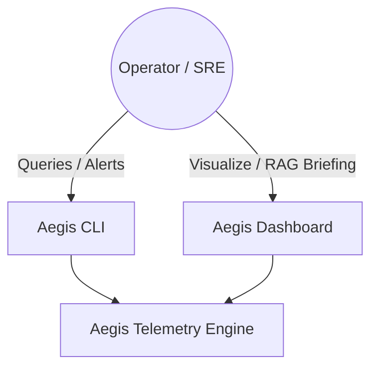
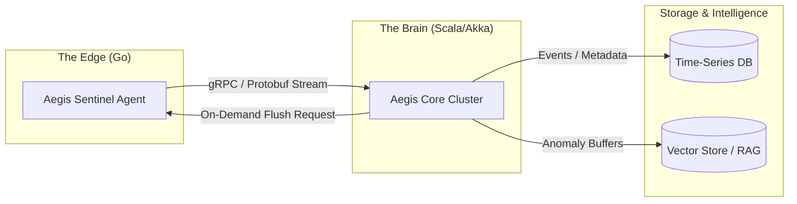

# Aegis: High-Fidelity Distributed Telemetry Engine
## Engineering Proposal & System Architecture

### 1. System Philosophy: Beyond Passive Observability

Standard observability stacks (Prometheus, Jaeger, ELK) suffer from the **"Context Gap."** They tell you *that* a service is failing (500 errors, high CPU) but rarely show you *why* without manual, post-mortem log digging.

Aegis shifts the paradigm from **Passive Monitoring** to **Reactive, High-Fidelity Tracing**. 

- **Passive (Old):** Collecting sampled metrics every 15-60 seconds. High-fidelity data is discarded to save bandwidth/storage.
- **Reactive (Aegis):** The edge agent maintains a rolling 60-second "Black Box" of every syscall, packet, and stack trace. This data is only transmitted when an anomaly is detected or requested, bridging the context gap with zero manual intervention.

---

### 2. C4 Component Architecture

#### Level 1: System Context
The high-level interaction between users and the Aegis ecosystem.

#### Level 2: Container (Edge vs. Core)
The interaction between the Go-based Sentinels and the Scala-based Brain.

#### Level 3: Component (Internal Logic)

**Go Sentinel (The Edge):**
- **Scraper:** Hooks into eBPF/Syscalls to capture system state.
- **Ring Buffer:** Stores 60s of raw telemetry in-memory.
- **Local Analytics:** Threshold-based triggers for anomaly detection.
- **gRPC Client:** Managed streaming with circuit breaking.

**Scala Cluster (The Brain):**
- **Ingestion Actor:** Handles thousands of concurrent gRPC streams.
- **State Map Actor:** Maintains a global view of agent health.
- **Correlation Engine:** Sliding-window analysis across multiple streams.
- **Persistence Layer:** Asynchronous writes to TSDB/Persistence.

---

### 3. The Communication Contract: gRPC & Protobuf

Aegis uses **gRPC** with **Protocol Buffers (proto3)** for the Go-to-Scala boundary.

**Why Protobuf?**
1. **Binary Serialization:** Vital for the high-volume streaming of syscall and packet data. Protobuf is significantly smaller and faster to parse than JSON.
2. **Strict Type Safety:** Ensures that the Go agent and Scala cluster always agree on the data schema, preventing runtime crashes due to malformed logs.
3. **Code Generation:** Native support for both Go and Scala (via ScalaPB) ensures the internal logic remains DRY (Don't Repeat Yourself).

---

### 4. Scaling & Reliability Strategy

#### Handling Backpressure
The Scala Brain utilizes the **Akka Actor Model**. When 10,000+ agents start streaming simultaneously:
- **Mailbox Buffering:** Ingestion actors buffer messages.
- **Dynamic Scaling:** The cluster spins up more worker nodes (Actors) to handle the load.
- **Adaptive Throttling:** If the Brain is saturated, it sends a "Slow Down" signal back to the Sentinels via the gRPC stream.

#### "Zero-Drop" Telemetry
During network partitions, Aegis maintains data integrity:
- **Local Persistence:** Go agents spool telemetry to a local high-performance cache (e.g., BadgerDB or flat files) if the Brain is unreachable.
- **Replay Mechanism:** Once the connection is restored, agents perform a "backfill" upload, prioritizing the most recent anomaly data.

---

### 5. Chaos Engineering & Failure Modes

| Scenario | System Response |
| :--- | :--- |
| **Brain Outage** | Agents enter "Dumb Mode." They stop streaming but continue scraping to local buffers. |
| **Network Partition** | Regional clusters operate independently; global state is reconciled once the partition heals. |
| **Agent Crash** | The Ring Buffer is lost, but the last flushed state remains in the Scala Brain. Watchdogs restart the agent immediately. |
| **Vector Store Down** | Diagnostic Briefings are queued. Raw telemetry is preserved in long-term storage for later processing. |
